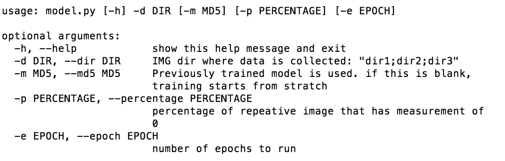

**Behavioral Cloning Project**

The goals / steps of this project are the following:
* Use the simulator to collect data of good driving behavior
* Build, a convolution neural network in Keras that predicts steering angles from images
* Train and validate the model with a training and validation set
* Test that the model successfully drives around track one without leaving the road
* Summarize the results with a written report


[//]: # (Image References)

[image1]: ./examples/placeholder.png "Model Visualization"
[image2]: ./examples/placeholder.png "Grayscaling"
[image3]: ./examples/placeholder_small.png "Recovery Image"
[image4]: ./examples/placeholder_small.png "Recovery Image"
[image5]: ./examples/placeholder_small.png "Recovery Image"
[image6]: ./examples/placeholder_small.png "Normal Image"
[image7]: ./examples/placeholder_small.png "Flipped Image"

## Rubric Points ##
Here I will consider the [rubric points](https://review.udacity.com/#!/rubrics/432/view) individually and describe how I addressed each point in my implementation.  

---
### Files Submitted & Code Quality ##

#### 1. Submission includes all required files and can be used to run the simulator in autonomous mode

My project includes the following files:
* model.py containing the script to create and train the model
* drive.py for driving the car in autonomous mode. did not change from original version.
* model.h5 containing a trained convolution neural network 
* writeup_report.md summarizing the results

#### 2. Submission includes functional code
Using the Udacity provided simulator and my drive.py file, the car can be driven autonomously around the track by executing 
```sh
python drive.py model.h5
```

#### 3. Submission code is usable and readable

The model.py file contains the code for training and saving the convolution neural network. It also accepts a command line argument to take trained model from privious run. In this way, we can continously train neural network with newly captured data. User can define how many epochs in each run. Also user can have a way to reduce the repetitive image with zero measurement by defining a percentage. The file shows the pipeline I used for training and validating the model, and it contains comments to explain how the code works



Examples 
   start a fresh training without loading any h5. three new captured data sets are in ./data, ./revers, and ./my_data

      python model.py -d "./data;./revers;./my_data"

   load previously trained model.h5 and train with ./data

      python model.py -d "./data" -m model.h5

   only use 30 percent of images with zero measurement. run epoch of 50

      python model.py -d "./data" -m model.h5 -p 0.3 -e 50

### Model Architecture and Training Strategy

#### 1. An appropriate model architecture has been employed

using Nvida covnet architecture primarily but with some dropouts. The input image is normalized with lambda layer in input layer(code line 189) The model includes RELU layers to introduce nonlinearity

| Description    |
|:---------------|
| convolutional with 24 filters and filter 5x5, stride (2,2), activation of relu |
| convolutional with 36 filters and filter 5x5, stride (2,2), activation of relu |
| convolutional with 48 filters and filter 5x5, stride (2,2), activation of relu |
| Dropout probability 0.3 |
| convolutional with 64 filters and filter 5x5, stride (1,1), activation of relu |
| convolutional with 64 filters and filter 5x5, stride (1,1), activation of relu|
| flatten layer |
| densely connect layer of 100 |
| densely connect layer of 50 |
| is output layer with one node. |

#### 2. Attempts to reduce overfitting in the model

The model contains dropout layers in order to reduce overfitting (model.py lines 195 and line 199). 

The model was trained and validated on different data sets to ensure that the model was not overfitting. How to collect or generate augumented data set will be explained later. The model was tested by running it through the simulator and ensuring that the vehicle could stay on the track.

#### 3. Model parameter tuning

The model used an adam optimizer, so the learning rate was not tuned manually (model.py line 216).

model.compile(loss='mse', optimizer='adam')

#### 4. Appropriate training data

Training data was chosen to keep the vehicle driving on the road with multiple laps i.e. clockwise, counter clockwise and focused sharp turn after bridges. Each type of those training data was chosen carefully to keep in in center of road with smooth steering.

For details about how I created the training data, see the next section. 

### Model Architecture and Training Strategy

#### 1. Solution Design Approach

The overall strategy for deriving a model architecture was to use Nvidia Convnet and modify it to avoid overfitting.

My first step is to build the whole thing with simple network, i.e. one Neuron and try out the image preprocessing, save and load the model.h5. Once the simple network works even though it did not drive on center of lane, it gives all necessory components and flexibility to debug. 

Then take look at the appropriate neural network such as Nvidia Convnet. I thought this model might be appropriate because it was demonstrated nicely by Nvidia published here: https://devblogs.nvidia.com/parallelforall/deep-learning-self-driving-cars/

In order to gauge how well the model was working, I split my image and steering angle data into a training(80%) and validation set(20%).  

To combat the overfitting, I modified the model to add lamdba normalization layer(code ), the dropout layer at linecode at 195 and 199. Also did cropping image to focus the image information only on the road.

The final step was to run the simulator to see how well the car was driving around track one. There were a few spots where the vehicle fell off the track i.e. few big turns:

[todo] to add images:

to improve the driving behavior in these cases, I added the reverse driving lap to capture the driving data.

At the end of the process, the vehicle is able to drive autonomously around the track without leaving the road.

#### 2. Final Model Architecture

The final model architecture (model.py lines 171-204) consisted of a convolution neural network with the following layers and layer sizes ...

|Codeline   | Model Layer            | Description    |
|:----- |:-----------------|:---------------|
|189 | First layer | using lambda to normalize the image |
|190 | second layer| cropping the upper half image so only majority of road is only presented. |
|191 | third layer | convolutional with 24 filters and filter 5x5, stride (2,2), activation of relu |
|192 | fourth layer| convolutional with 36 filters and filter 5x5, stride (2,2), activation of relu |
|194 | fifth layer | convolutional with 48 filters and filter 5x5, stride (2,2), activation of relu |
|195 |             | Dropout probability 0.3 |
|196 | sixth layer | convolutional with 64 filters and filter 5x5, stride (1,1), activation of relu |
|197 | seventh layer| same as sixth layer |
|198 | eighth layer| flatten layer |
|199 |             | dropout probability 0.3 |
|200 | ninth layer | densely connect layer of 100 |
|202 | tenth layer | densely connect layer of 50 |
|203 | last layer  | is output layer with one node. |


#### 3. Creation of the Training Set & Training Process

To capture good driving behavior, I tried multiple times to make sure I can steer the car on the center road with smooth steering. When my mouse moving is much smooth, then I recorded couple of laps that seems good at turns. One out of them is picked for training purpose. Here is one example of counter clock wise driving:


I then recorded the vehicle in clock wise driving which is reverse direction compared to the default driving direction. Similarily, I did multiple driving and recorded multiple training data. Then I picked one for the training purpose with smoothest steering. Here is clock wise driving.


Often I found the model gets off track on sharp turn or the road side does not have clear line. I captured multiple data set only relates to those failing turn and training them.

To augment the data sat, I also flipped images and angles thinking that this would help generalize the model. For example, here is an image that has then been flipped:


After the collection process, I had X number of data points. I then preprocessed this data by ...


I finally randomly shuffled the data set and put Y% of the data into a validation set. 

I used this training data for training the model. The validation set helped determine if the model was over or under fitting. The ideal number of epochs was 30 as evidenced by validation loss is not going lower than 0.0096 and is around 0.01. I used an adam optimizer so that manually training the learning rate wasn't necessary.

#################################################################
Following is snapshot of image process examples:

(carnd-term1) big-iMac:behavior_cloning dad$ python model.py -d "./my_data;./turn1_after_bridge;./revs_1" -p 1
Using TensorFlow backend.
Namespace(dir='./my_data;./turn1_after_bridge;./revs_1', epoch=50, md5=None, percentage=1.0)
before add the side camera. found following entried in csv. 

./my_data/driving_log.csv
./turn1_after_bridge/driving_log.csv
./revs_1/driving_log.csv
total entries in ['./my_data', './turn1_after_bridge', './revs_1'] is **3965** 
after preprocess, following is picking up image with defined percetage of zero measurement 
total entries of **non-zero measurements is 2992** 
total entries of **zero measurements is 973** 
total entries after select 1.0 zero measurements is 3965 
after adding flipped image and side cameras, here is **total number of images: 15852** 
